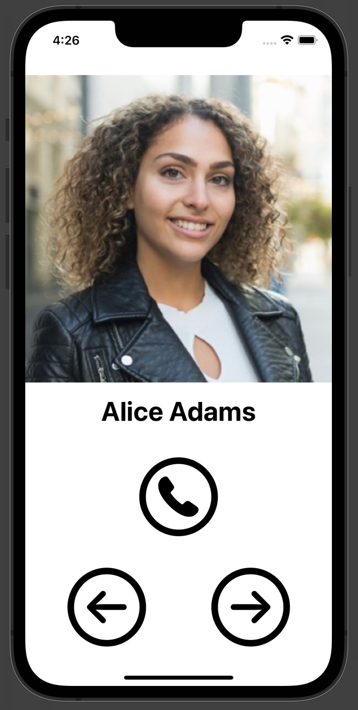

#  BoldContacts

BoldContacts is an app is a greatly-simpler way to browse contacts and connect to them.

BoldContacts is good for people experiencing vision disabiltiies, cognitive disabilties, or motor disabiltiies. The app displays each contact with a large photo, large text, and large buttons.
 
BoldContacts started because my family members have Alzheimer's disease and Parkison's disease, and are unable to use the typical contacts app. My hope is BoldContacts helps them.

BoldContacts welcomes constuctive feedback to <a href="mailto:joel@joelparkerhenderson.com">joel@joelparkerhenderson.com</a>.

## Screenshot

The app shows each contact with:

* The person's photo and person's name.

* One button to connect to the contact e.g. phone the person.

* Two buttons to navigate among contacts e.g. previous contact, next contact. 
    

## Help Wanted

If you have Alzheimer's or Parkinson's, or are a caretaker, can you contact us?

If you are a donor or fundraiser, can you help us raise money for this project? 

If you are an Apple iOS Swift developer, can you volunteer your expertise?

## Goals

Good usability for people who experience motor difficulties.

  * Such as arthritis, or nerve damage, or reflex tremor, etc. 

Good usability for people who experience vision difficulties.

  * Such as partially sighted vision, or double vision, or blurred vision, or hazy vision, etc. 

Good usability for people who experience cognitive difficulties.

  * Such as technical inexperience, or memory loss, or confusion.

## About

* Version: 0.5.0

* Updated: 2022-08-19T20:45:43Z

* Contact: <a href="mailto:joel@joelparkerhenderson.com">joel@joelparkerhenderson.com</a>.

* License: <a href="https://spdx.org/licenses/GPL-3.0-or-later.html">GPL-3.0-or-later</a> or contact us for a custom license. 

## Documentation

* [Scope](doc/scope.md)

* [Human interface guidelines](doc/human-interface-guidelines.md)

* [Xcode project overview](doc/xcode-project-overview.md)

* [Technical questions](doc/technical-questions.md)
